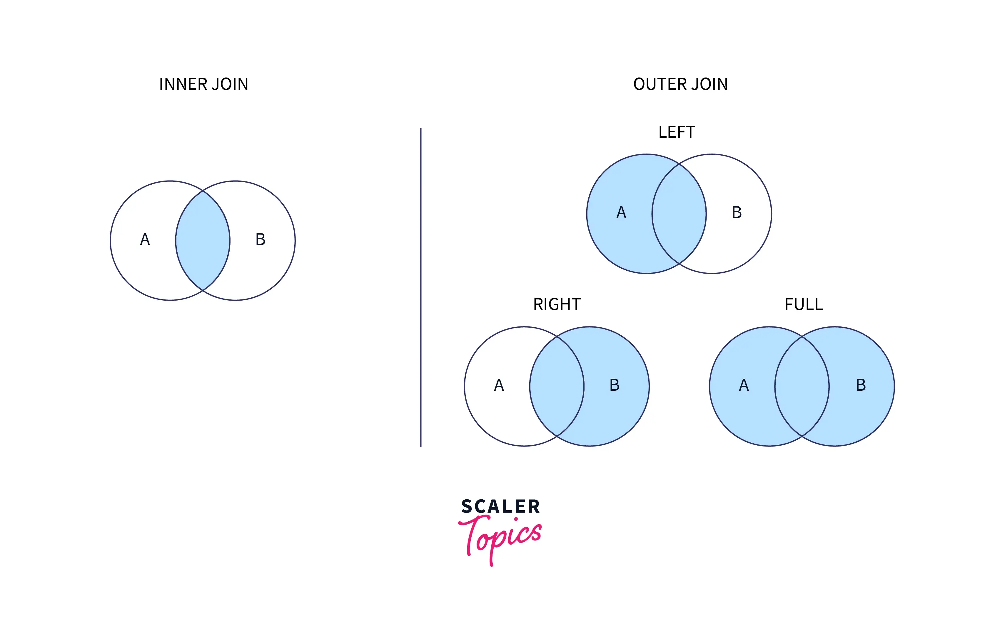
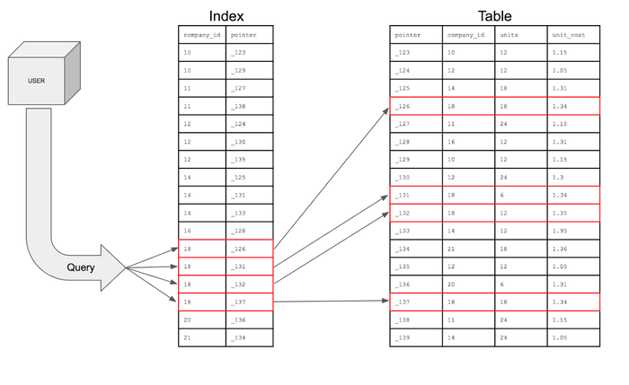

# Database Knowledge

## Fundamental

<details>
  <summary>Understand how sql run</summary>
  <br/>

  If the search were presented visually, it would look like this:
  
  
</details>

### Joins

<details>
  <summary>Explain the difference between INNER JOIN and OUTER JOIN</summary>
  <br/>

  + `INNER JOIN`: Returns only the rows that have matching values in both tables.
  + `OUTER JOIN`: Returns **all the rows from one** table and the **matched rows from the second** table. If there is no match, the result is **NULL**.
  
</details>

<details>
  <summary>What are the different types of OUTER JOINs</summary>
  <br/>

  
  
</details>

### Indexes

<details>
  <summary>What is an index in a database?</summary>
  <br/>

  An index in a database is a data structure. It works similarly to an index in a book, allowing the database to quickly locate and access the data without scanning the entire table.
  
</details>

<details>
  <summary>Type of Indexes</summary>
  <br/>

  _PostgreSQL:_

  + **B-tree (default):** It’s used for comparisons like `<` _(Less than)_, `<=` _(Less than or equal to)_, `=` _(Equal to)_, `>=` _(Greater than or equal to)_, `>` _(Greater than)_, and for pattern matching with `LIKE` and `~` _(tilde)_ when the pattern is anchored at the beginning.
  + **Hash:** Suitable for simple equality comparisons (=).
  + **GIN (Generalized Inverted Index):**  Best for columns containing multiple values, such as arrays, JSONB, ...
  + **BRIN (Block Range INdex):** Efficient for very large tables with a linear sort order, such as time-series data.
  
</details>

<details>
  <summary>How do indexes work?</summary>
  <br/>

  
  
</details>

<details>
  <summary>Trade-offs between creating an index and not creating an index</summary>
  <br/>

  **Advantages:**
  + Improved Query Performance
  + Faster Sorting and Searching
  + Enhanced Join Performance
    
  **Disadvantages:**
  + Increased Storage Requirements
  + Slower Data Modification
  + Regular Maintenance
  
</details>

<details>
  <summary>Clustered indexes</summary>
  <br/>

  + Cluster index is a type of index which sorts the data rows in the table on their key values. A table can have _**only one clustered index**_. 
  + If a table already has a _primary key_, which by default creates a clustered index, you _**cannot**_ create another clustered index on _**the same table**_.
  + When you insert **_a new record_** into a table with _**a clustered index**_, the database engine will immediately place the new record in the correct position according to the clustered index.

  _Note:_ Unlike some other databases where indexes can be clustered and directly affect the physical storage order of the data, in PostgreSQL, **indexes are always secondary**. This means that the index data is stored in a separate structure, and the index records contain pointers to the corresponding data rows in the main table.
  
</details>

<details>
  <summary>Non-clustered indexes</summary>
  <br/>

  A non-clustered index is an index structure that is separate from the actual data stored in a table. Unlike a clustered index, a non-clustered index creates a logical order for data rows and includes pointers to the actual data rows.

  
  
  _Non-clustered index._
</details>

<details>
  <summary>How can you identify indexes that are not being used effectively?</summary>
  <br/>

  _In SQL Server_
  + Use Dynamic Management Views sys.dm_db_index_usage_stats. This view provides details on how often an index is used for seeks, scans, lookups, and updates. If an index shows very low or zero usage, it might be a candidate for removal.
  ```
  SELECT 
    OBJECT_NAME(S.[OBJECT_ID]) AS [Table Name],
    I.[NAME] AS [Index Name],
    USER_SEEKS, USER_SCANS, USER_LOOKUPS, USER_UPDATES
  FROM 
      SYS.DM_DB_INDEX_USAGE_STATS AS S
      INNER JOIN SYS.INDEXES AS I ON I.[OBJECT_ID] = S.[OBJECT_ID] AND I.INDEX_ID = S.INDEX_ID
  WHERE 
      OBJECTPROPERTY(S.[OBJECT_ID],'IsUserTable') = 1
      AND S.database_id = DB_ID();

  ```
  + Use Dynamic Management Views sys.dm_db_index_operational_stats, provides information on the operational aspects of indexes, such as insert, update, and delete operations.
  ```
  SELECT 
      OBJECT_NAME(A.[OBJECT_ID]) AS [Table Name],
      I.[NAME] AS [Index Name],
      A.LEAF_INSERT_COUNT, A.LEAF_UPDATE_COUNT, A.LEAF_DELETE_COUNT
  FROM 
      SYS.DM_DB_INDEX_OPERATIONAL_STATS (DB_ID(), NULL, NULL, NULL) A
      INNER JOIN SYS.INDEXES AS I ON I.[OBJECT_ID] = A.[OBJECT_ID] AND I.INDEX_ID = A.INDEX_ID
  WHERE 
      OBJECTPROPERTY(A.[OBJECT_ID],'IsUserTable') = 1;
  ```
_In MySQL_
+ Use the `INFORMATION_SCHEMA` tables to identify unused indexes.

_In Postgres_
+ **pg_stat_user_indexes:** This view provides statistics about index usage. You can query it to find indexes that have low or zero usage.
```
SELECT 
    schemaname, 
    relname AS tablename, 
    indexrelname AS indexname, 
    idx_scan AS number_of_scans 
FROM 
    pg_stat_user_indexes 
WHERE 
    idx_scan = 0;
```
  
</details>

## Optimize performance
<details>
  <summary>Using explicit column names in SELECT</summary>
  <br/>

  + Selecting only the columns you need can improve query performance.
  + It makes your query easier to read and understand.

  _Wrong:_
  ```
  SELECT * FROM employees;
  ```
  _Correct:_
  ```
  SELECT employee_id, first_name, last_name, department FROM employees;
  ```
  
</details>
<details>
  <summary>Avoid abusing SELECT DISTINCT</summary>
  <br/>
  
  `SELECT DISTINCT` can consumes a lot of resources. Should use appropriate joins and conditions to avoid `SELECT DISTINCT`.
  
</details>

<details>
  <summary>Use index</summary>
  <br/>
+ Identify columns used frequently in WHERE, JOIN, and ORDER BY clauses, and create indexes can improve query performance.
+ Script used to identify missing indexes.
  
</details>

<details>
  <summary>Avoid SQL injection</summary>
  <br/>
  _Problem:_
  A web application with a login form where users enter their username and password. 

  + Use parameterized queries to prevent SQL injection attacks. The application uses the following SQL query to check the credentials:
  ```
  SELECT * FROM users WHERE username = 'user_input' AND password = 'user_input';
  ```
  And attacker can use SQL injection to enter the following into the username field:
  ```
  ' OR '1'='1
  ```
  And the SQL would look like:
  ```
  SELECT * FROM users WHERE username = '' OR '1'='1' AND password = '';
  ```
  The condition `'1'='1'` is always true, so this query will reurn all rows from the `users` table.

  _Solution:_
  + Use parameterized queries to prevent SQL injection attacks.
</details>

<details>
  <summary>Avoid using implicit data type conversion</summary>
  <br/>

  Implicit conversions occur when database automatically converts data from one type to another during query execution. This can lead to performance issues, and it can prevent the use of indexes.

  _Wrong:_
  ```
  SELECT * FROM Sales WHERE OrderDate = '2023-08-26';
  ```
  _Correct:_
  To avoid this, you should explicitly convert the VARCHAR to DATETIME:
  ```
  SELECT * FROM Sales WHERE OrderDate = CONVERT(DATETIME, '2023-08-26');
  ```
  
</details>

<details>
  <summary>Using NOT EXISTS instead of NOT IN</summary>
  <br/>

  `NOT EXISTS`
  + Generally performs better with large datasets. It stops processing as soon as it finds a match.
  + Handle NULL value. It returns results even if there are NULLs in the subquery.
  
  `NOT IN`
  + Can be slower, especially with large datasets, because it has to check all values in the list.
  + If any value in the list is NULL, the entire result set will be empty.
  
</details>

<details>
  <summary>Avoid arithmetic operators in the WHERE clause</summary>
  <br/>

  Using arithmetic operations in the WHERE clause can lead to performance issues because it may prevent the database from using indexes.

  _Wrong:_
  ```
  SELECT * FROM Orders
  WHERE OrderAmount - Discount > 100;
  ```
  _Correct:_
  ```
  SELECT * FROM Orders
  WHERE OrderAmount > 100 + Discount;
  ```
</details>

<details>
  <summary>Avoid Function on the WHERE clause</summary>
  <br/>

  ```
  SELECT * FROM Orders
  WHERE SUBTRING(CustomerName) = 'JOHN DOE';
  ```
  In this query, the `SUBTRING` function is applied to the CustomerName column. This means the function must be executed for each row.

  _Solution:_
  ```
  SELECT * FROM Orders
  WHERE CustomerName LIKE 'F%';
  ```
  
</details>
<details>
  <summary>Use JOINS instead of Subqueries</summary>
  <br/>
  
  _Subquery:_
  ```
  SELECT OrderID, OrderDate, TotalAmount
  FROM Orders
  WHERE CustomerID IN (SELECT CustomerID FROM Customers WHERE Country = 'USA');
  ```

  _`JOIN:`_
  ```
  SELECT Orders.OrderID, Orders.OrderDate, Orders.TotalAmount
  FROM Orders
  INNER JOIN Customers ON Orders.CustomerID = Customers.CustomerID
  WHERE Customers.Country = 'USA';
  ```

</details>
<details>
  <summary>Use EXISTS over COUNT(*) to check if data exists</summary>
  <br/>

  `EXISTS`: Stops processing as soon as it finds a matching row.
  `COUNT(*)`: Counts all matching rows, which can be slower.

  _Using `COUNT(*)`:_
  ```
  IF (SELECT COUNT(*) FROM Orders WHERE CustomerID = 123) > 0
  BEGIN
      PRINT 'Customer has orders';
  END
  ```
  This query counts **all orders** for the customer.

  _Using `EXISTS`:_
  ```
  IF EXISTS (SELECT 1 FROM Orders WHERE CustomerID = 123)
  BEGIN
      PRINT 'Customer has orders';
  END
  ```
  This query **stops as soon as** it finds the first matching order.
  
</details>
<details>
  <summary>Use UNION ALL instead of UNION</summary>
  <br/>
  
</details>
<details>
  <summary>Avoid using cursor</summary>
  <br/>
  
</details>
<details>
  <summary>View vs Stored procedure</summary>
  <br/>
  
</details>

## Locks in SQL - A deep dive
<details>
  <summary>How Locks Work in PostgreSQL</summary>
  <br/>

  Locks in PostgreSQL are mechanisms used to control concurrency and prevent data inconsistencies. They ensure that multiple transactions can access and modify data without interfering with each other.

  In PostgreSQL, locks are acquired automatically by the database system whenever a transaction accesses or modified.
  
</details>

<details>
  <summary>Locking Mechanisms</summary>
  <br/>

  **Explicit Locking:** Manually acquiring and releasing locks using commands like `SELECT FOR UPDATE` and `SELECT FOR SHARE`.

  **Implicit Locking:** PostgreSQL automatically acquires and releases locks based on operations or queries performed.

  _Example:_

  ```
  -- Acquire an exclusive lock on a row:
  SELECT * FROM users WHERE user_id = 1 FOR UPDATE;
  
  -- Acquire a shared lock on a row:
  SELECT * FROM users WHERE user_id = 1 FOR SHARE;
  ```
</details>

https://postgres-locks.husseinnasser.com/

### Table lock
<details>
  <summary>Table level lock</summary>
  <br/>

  Table locks apply to entire tables and are used to prevent other transactions from accessing the table in conflicting ways.
  
</details>

<details>
  <summary>Type of locks</summary>
  <br/>

  + AccessShareLock
  + RowShareLock
  + RowExclusiveLock
  + ShareUpdateExclusiveLock
  + ShareLock
  + ShareRowExclusiveLock
  + ExclusiveLock
  + AccessExclusiveLock
  
</details>

<details>
  <summary>Examples</summary>
  <br/>

  **AccessShareLock:**
  ```
  begin;
  lock table Email IN ACCESS SHARE MODE;
  select * from Email;
  ```
  _The lock is acquired on a specific table via the PostgreSQL SELECT command. After acquiring the lock on the table, we are only able to read data from it and not able to edit it._

  **AccessExclusiveLock:**
  ```
  begin;
  lock table Email IN ACCESS EXCLUSIVE MODE;
  ```
  _Only the person who applied the lock to the table can access it when utilizing it._
  
</details>

### Row locks
<details>
  <summary>Row level lock</summary>
  <br/>

  Row locks apply to individual rows within a table. They are used to prevent other transactions from modifying or deleting specific rows while they are being accessed.
  
</details>

<details>
  <summary>Type of locks</summary>
  <br/>

  + FOR KEY SHARE
  + FOR SHARE
  + FOR NO KEY UPDATE
  + FOR UPDATE

  **Conflict Modes in Row Level Locks**:
  |                   | FOR KEY SHARE | FOR SHARE | FOR NO KEY UPDATE | FOR UPDATE |
  |-------------------|---------------|-----------|-------------------|------------|
  | FOR KEY SHARE     |               |           |                   |      X     |
  | FOR SHARE         |               |           |         X         |      X     |
  | FOR NO KEY UPDATE |               |     X     |         X         |      X     |
  | FOR UPDATE        |       X       |     X     |         X         |      X     |
  
</details>

### Page locks
<details>
  <summary>Page level lock</summary>
  <br/>

  Pagel locks are native to two types. **Share** & **Exclusive locks** limit read/write access to table pages. After a row is fetched or updated, these locks are immediately released.
</details>

### Dead locks
<details>
  <summary>Simple case</summary>
  <br/>

  we have two tables: `Accounts` and `Transactions`.

  ```
  CREATE TABLE Accounts (
    AccountID INT PRIMARY KEY,
    Balance DECIMAL(10, 2)
  );
  
  CREATE TABLE Transactions (
      TransactionID INT PRIMARY KEY,
      AccountID INT,
      Amount DECIMAL(10, 2),
      FOREIGN KEY (AccountID) REFERENCES Accounts(AccountID)
  );
  ```

  **Transaction 1:**

  ```
  BEGIN TRANSACTION;
  UPDATE Accounts SET Balance = Balance - 100 WHERE AccountID = 1;

  -- Waits for Transaction 2 to release the lock on AccountID = 2

  UPDATE Accounts SET Balance = Balance + 100 WHERE AccountID = 2;
  COMMIT;
  ```

  **Transaction 2:**
  ```
  BEGIN TRANSACTION;
  UPDATE Accounts SET Balance = Balance + 200 WHERE AccountID = 2;

  -- Waits for Transaction 1 to release the lock on AccountID = 1

  UPDATE Accounts SET Balance = Balance - 200 WHERE AccountID = 1;
  COMMIT;
  ```

  + **Transaction 1** locks `AccountID = 1` and then tries to lock `AccountID = 2`.
  + **Transaction 2** locks `AccountID = 2` and then tries to lock `AccountID = 1`.

</details>

## Isolation level

## Data migration
### Flyway

