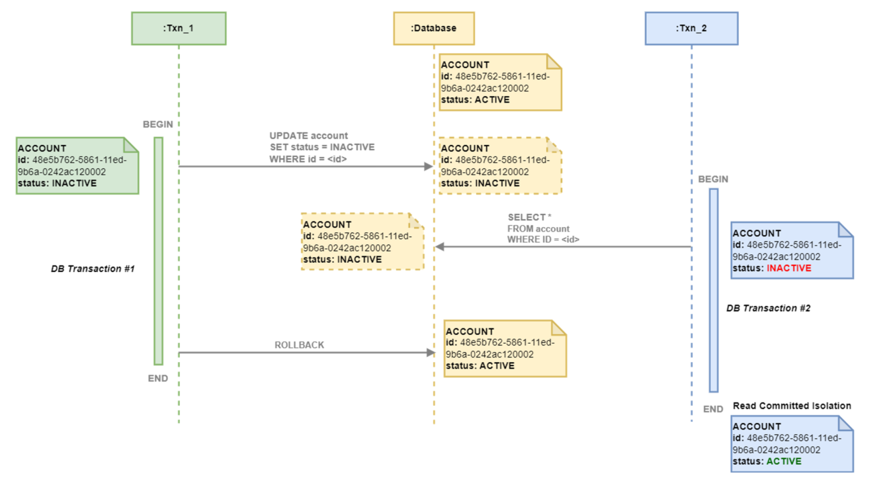
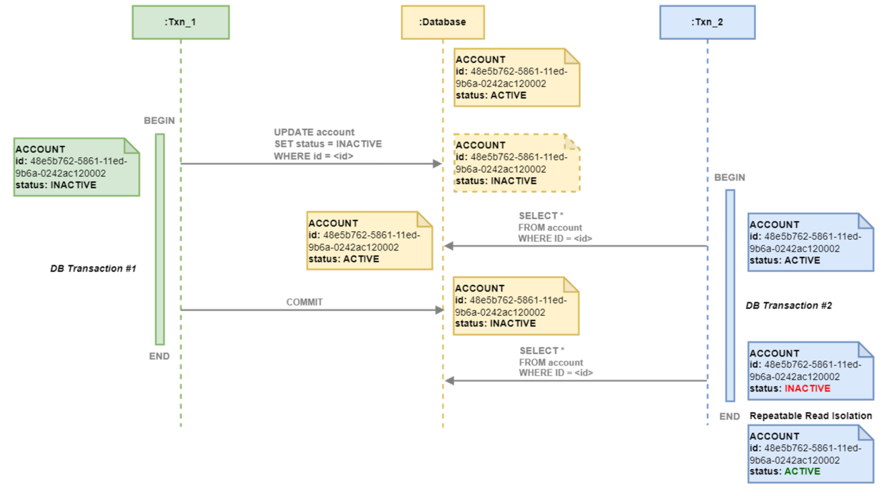

# Database Knowledge

## Fundamental

<details>
  <summary>Understand how sql run</summary>
  <br/>

  If the search were presented visually, it would look like this:
  
  
</details>

### Joins

<details>
  <summary>Explain the difference between JOINS</summary>
  <br/>

  

  + `INNER JOIN`: Returns the rows that have matching values in _both_ tables.
  + `LEFT JOIN` (`LEFT OUTER JOIN`): Return all records from the _left_ table and the matching records from the _right_ table. If no match is found, `NULL` values are returned for columns from the _right_ table.
  + `RIGHT JOIN` (`RIGHT OUTER JOIN`): Return all records from the _right_ table and the matching records from the _left_ table. If no match is found, `NULL` values are returned for columns from the _left_ table.
  + `FULL JOIN` (`OUTER JOIN`, `FULL OUTER JOIN`): Returns all records that have matching values in _both_ tables. With records no match, it will return `NULL` value.
  + `CROSS JOIN`: Every row from _left_ table is paired with every row from _right_ table.
  
</details>

### Indexes

<details>
  <summary>What is an index in a database?</summary>
  <br/>

  An index in a database is a data structure. It works similarly to an index in a book, allowing the database to quickly locate and access the data without scanning the entire table.
  
</details>

<details>
  <summary>Type of Indexes</summary>
  <br/>

  _PostgreSQL:_

  + **B-tree (default):** It’s used for comparisons like `<` _(Less than)_, `<=` _(Less than or equal to)_, `=` _(Equal to)_, `>=` _(Greater than or equal to)_, `>` _(Greater than)_, and for pattern matching with `LIKE` and `~` _(tilde)_ when the pattern is anchored at the beginning.
  + **Hash:** Suitable for simple equality comparisons (=).
  + **GIN (Generalized Inverted Index):**  Best for columns containing multiple values, such as arrays, JSONB, ...
  + **BRIN (Block Range INdex):** Efficient for very large tables with a linear sort order, such as time-series data.
  
</details>

<details>
  <summary>How do indexes work?</summary>
  <br/>

  

</details>

<details>
  <summary>Composite index</summary>
  <br/>

  Select column A, B from a table.

  **The difference between indexing only column A, only column B**

  + _Indexing only column A_

  When you create an index on only **column A**, the database can use this index to optimize queries when involved **column A** in the `WHERE`, `ORDER BY`, or `GROUP BY` clauses.

  ```
  SELECT * FROM table WHERE A = 10;
  ```

  However, if you query using **column B** or both **columns A and B**, the index on only **column A** will not help with filtering on **column B**

  ```
  SELECT * FROM table WHERE A = 10 AND B = 20;
  ```
  the index on **column A** to filter by **A** first, but filtering by **B** will not be optimized.
  
  + _Indexing only column B_

  When you create an index on only **column B**, the database can quickly locate rows where **B** matches
  ```
  SELECT * FROM table WHERE B = 20;
  ```
  If you filter on **column A** or on both **columns A and B**, the index on only **column B** won’t help with filtering by **A**.
  ```
  SELECT * FROM table WHERE A = 10 AND B = 20;
  ```
  The filtering on **column A** separately after retrieving the rows for **B**, leading to less efficient query performance.

  **Indexing both columns A and B (composite index)**

  When you create a composite index on both **columns A and B**, you optimize queries that involve both columns. With **column A** being the first level of filtering and **column B** being the second.

  ```
  SELECT * FROM table WHERE A = 10 AND B = 20;
  ```
  The composite index on (A, B) will allow the database to directly find the rows `WHERE` both A and B match the conditions.

  Additionally, this index can still be used for queries that only filter on **column A**
  ```
  SELECT * FROM table WHERE A = 10;
  ```
  However, it will not be as useful for queries that only filter on **column B**
  ```
  SELECT * FROM table WHERE B = 20;
  ```
  Because the index is ordered with A first, queries that filter only B won’t benefit.

  Tips:
  + If you frequently query both A and B together, use a composite index on (A, B).
  + If you often query A alone, the composite index on (A, B) will still be helpful.
  + If you frequently query B alone, consider a separate index on column B or adjust your indexing strategy based on query patterns.
  
</details>

<details>
  <summary>Trade-offs between creating an index and not creating an index</summary>
  <br/>

  **Advantages:**
  + Improved Query Performance
  + Faster Sorting and Searching
  + Enhanced Join Performance
    
  **Disadvantages:**
  + Increased Storage Requirements
  + Slower Data Modification
  + Regular Maintenance
  
</details>

<details>
  <summary>Clustered indexes</summary>
  <br/>

  + **Physical Ordering:** The table rows are physically stored in the order by the clustered index. For example, if we create a clustered index on the `ID` column, the table rows will be stored in _ascending_ or _descending_ order by the `ID` values.
  + **Only One Per Table:** A table can have only one clustered index. (because the data can only be physically ordered in one way).
  + **Primary Key:** Often, the primary key of a table is used as the clustered index by default, although this is _not mandatory_.
  + **Faster Access:** Since the rows are stored in the index order, selecting rows based on ranges of indexed values is much faster compared to non-clustered indexes.
  + **Drawbacks:** The downside of a clustered index is that inserting, updating or deleting rows can be slower.
  
  _Note:_ Unlike some other databases where indexes can be clustered and directly affect the physical storage order of the data, in PostgreSQL, **indexes are always secondary**. This means that the index data is stored in a separate structure, and the index records contain pointers to the corresponding data rows in the main table.
  
</details>

<details>
  <summary>Non-clustered indexes</summary>
  <br/>

  + A non-clustered index is an index structure that is separate from the actual data stored in a table. Unlike a clustered index, a non-clustered index creates a logical order for data rows and includes pointers to the actual data rows.
  + It does not change the physical storage of the table.
  + A table can have multiple non-clustered indexes. because these indexes are separate from the actual table data.

  
  
  _Non-clustered index._
</details>

<details>
  <summary>Clustered indexes vs Non-clustered indexes</summary>
  <br/>

  **Clustered indexes**
  + Faster for range queries and queries that return data in the order of the index.
  + Slower for updates/inserts/deletes, they require rearranging the rows to maintain the order of the clustered index.

  **Non-Clustered Index:**
  + Faster to search for exact values (e.g., `SELECT * FROM table WHERE LastName = 'Smith'`), but generally slower for range queries compared to a clustered index.
  + Inserting, updating, or deleting rows has less impact on the overall physical table structure

</details>

<details>
  <summary>How can you identify indexes that are not being used effectively?</summary>
  <br/>

  _In SQL Server_
  + Use Dynamic Management Views sys.dm_db_index_usage_stats. This view provides details on how often an index is used for seeks, scans, lookups, and updates. If an index shows very low or zero usage, it might be a candidate for removal.
  ```
  SELECT 
    OBJECT_NAME(S.[OBJECT_ID]) AS [Table Name],
    I.[NAME] AS [Index Name],
    USER_SEEKS, USER_SCANS, USER_LOOKUPS, USER_UPDATES
  FROM 
      SYS.DM_DB_INDEX_USAGE_STATS AS S
      INNER JOIN SYS.INDEXES AS I ON I.[OBJECT_ID] = S.[OBJECT_ID] AND I.INDEX_ID = S.INDEX_ID
  WHERE 
      OBJECTPROPERTY(S.[OBJECT_ID],'IsUserTable') = 1
      AND S.database_id = DB_ID();

  ```
  + Use Dynamic Management Views sys.dm_db_index_operational_stats, provides information on the operational aspects of indexes, such as insert, update, and delete operations.
  ```
  SELECT 
      OBJECT_NAME(A.[OBJECT_ID]) AS [Table Name],
      I.[NAME] AS [Index Name],
      A.LEAF_INSERT_COUNT, A.LEAF_UPDATE_COUNT, A.LEAF_DELETE_COUNT
  FROM 
      SYS.DM_DB_INDEX_OPERATIONAL_STATS (DB_ID(), NULL, NULL, NULL) A
      INNER JOIN SYS.INDEXES AS I ON I.[OBJECT_ID] = A.[OBJECT_ID] AND I.INDEX_ID = A.INDEX_ID
  WHERE 
      OBJECTPROPERTY(A.[OBJECT_ID],'IsUserTable') = 1;
  ```
_In MySQL_
+ Use the `INFORMATION_SCHEMA` tables to identify unused indexes.

_In Postgres_
+ **pg_stat_user_indexes:** This view provides statistics about index usage. You can query it to find indexes that have low or zero usage.
```
SELECT 
    schemaname, 
    relname AS tablename, 
    indexrelname AS indexname, 
    idx_scan AS number_of_scans 
FROM 
    pg_stat_user_indexes 
WHERE 
    idx_scan = 0;
```
  
</details>

### Transaction

<details>
  <summary>What is transaction</summary>
  <br/>

  A transaction in the context of databases is a sequence of one or more SQL operations executed as a single unit of work.

  **Characteristics of Transactions:**
  + **Atomicity**
    + Ensures that all operations within a transaction are completed successfully. If any operation fails, the entire transaction is rolled back.
    + _Example:_ If a transaction involves transferring money from one account to another, both the debit and credit operations must succeed or fail together.
  + **Consistency**
    + Ensures that a transaction transform the database from one valid state to another.
    + _Example:_ If a transaction violates a database constraint (like a foreign key constraint), it will be rolled back to maintain consistency.
  + **Isolation**
    + Ensures that the operations of a transaction are isolated from those of other transactions.
    + _Example:_ If two transactions are updating the same account balance, isolation ensures that each transaction sees a consistent view of the data.
  + **Durability**
    + Ensures that once a transaction is committed, its changes are permanent.
    + _Example:_ After a transaction commits a bank transfer, the changes to the account balances are permanent.
  
</details>

<details>
  <summary>Isolation levels</summary>
  <br/>

  Isolation and read phenomena are fundamental concepts in database systems that ensure data consistency in concurrent environments. Higher isolation levels prevent more read phenomena.

  | Isolation Level   | Dirty Read   | Non-repeatable Read | Phantom Read | Serialization Anomaly |
  |-------------------|--------------|---------------------|--------------|-----------------------|
  | Read Uncommitted  | Possible     | Possible            | Possible     | Possible              |
  | Read Committed    | Not possible | Possible            | Possible     | Possible              |
  | Repeatable Read   | Not possible | Not possible        | Possible     | Possible              |
  | Serializable      | Not possible | Not possible        | Not possible | Not possible          |

  **Read Phenomena**
  + **Dirty read:** A transaction reads data that has been modified by another transaction but not yet committed. This can lead to inconsistent results.
  + **Non-repeatable read**: A transaction reads the same data multiple times and gets different results due to changes made by another committed transaction.
  + **Phantom read:** Occurs when a transaction reads a set of rows that satisfy a condition, but another transaction inserts or deletes rows that satisfy the same condition, because the first transaction to see a different set of rows if it re-reads.

  **isolation levels**
  + **Read uncommitted:** Allows dirty reads.
  + **Read committed:** Prevents dirty reads but allows non-repeatable reads and phantom reads.
  + **Repeatable Read:** Prevents dirty and non-repeatable reads but allows phantom reads.
  + **Serializable:** Prevents all three phenomena, ensuring complete isolation.
  
</details>

<details>
  <summary>Read Uncommitted</summary>
  <br/>

  **Dirty Read:**

  

  + _Transaction A_ updates the status of an account but hasn’t committed yet.
  + _Transaction B_ reads the updated status before _Transaction A_ commits.

  ```
  -- Transaction A
  BEGIN;
  UPDATE account SET status = 'inactive' WHERE id = '123e4567-e89b-12d3-a456-426614174000';
  
  -- Transaction B
  BEGIN;
  SELECT status FROM account WHERE id = '123e4567-e89b-12d3-a456-426614174000'; -- Reads 'inactive'
  ```
  + If _Transaction A_ rolls back, _Transaction B_ has read an invalid status.
  
  **Solution:**
  + **Read Committed** isolation level prevents dirty reads by ensuring that only _committed_ data is read.
  
</details>

<details>
  <summary>Read Committed</summary>
  <br/>

  **Non-Repeatable Read:**

  

  + _Transaction A_ reads the status of an account.
  + _Transaction B_ updates the status of the same account and commits.
  + _Transaction A_ reads the status again and sees a different value.

  ```
  -- Transaction A
  BEGIN;
  SELECT status FROM account WHERE id = '123e4567-e89b-12d3-a456-426614174000'; -- Reads 'active'
  
  -- Transaction B
  BEGIN;
  UPDATE account SET status = 'inactive' WHERE id = '123e4567-e89b-12d3-a456-426614174000';
  COMMIT;
  
  -- Transaction A
  SELECT status FROM account WHERE id = '123e4567-e89b-12d3-a456-426614174000'; -- Reads 'inactive'
  ```
  
  + _Transaction A_ sees different values for the same row.

  **Solution:** 
  + **Repeatable Read** isolation level prevents non-repeatable reads by ensuring that if a row is read twice in the same transaction, it will have the same value.
  
</details>
<details>
  <summary>Repeatable Read</summary>
  <br/>

  **Phantom Read:**

  + _Transaction A_ reads a set of rows that match a condition.
  + _Transaction B_ inserts a new row that matches the same condition and commits.
  + _Transaction A_ re-reads the rows and sees the new row.

  ```
  -- Transaction A
  BEGIN;
  SELECT * FROM account WHERE status = 'active'; -- Reads 10 rows
  
  -- Transaction B
  BEGIN;
  INSERT INTO account (id, status) VALUES ('123e4567-e89b-12d3-a456-426614174001', 'active');
  COMMIT;
  
  -- Transaction A
  SELECT * FROM account WHERE status = 'active'; -- Reads 11 rows
  ```
  + _Transaction A_ sees a different set of rows on re-reading.

  **Solution:**
  + **Serializable** isolation level prevents phantom reads by ensuring that no other transactions can insert, update, or delete rows that would affect the result set of the current transaction.
  
</details>

## Optimize performance

<details>
  <summary>Checklist to optimize database performance</summary>
  <br/>

  + **Query**
    + Select only the necessary data to reduce query execution time.
    + Avoid select distenct.
    + Using NOT EXISTS instead of NOT IN.
    + Use EXISTS over COUNT(*) to check if data exists.
    + Avoid unnecessary join.
  + **Indexing**
    + Create indexes on frequently queried columns.
  + **Database Tuning and Configuration:**
    + With large data, use partition to separate the big table to smaller tables. 
  + **Scaling Strategies**
    + Upgrade hardware resources like CPU and RAM.
  + Analysis
    + Use explain command to analyze query performance
    + With `Postgres`, query pg_stat_user_indexes table to check statistics about index usage.
</details>

### Query
<details>
  <summary>Using explicit column names in SELECT</summary>
  <br/>

  + Selecting only the columns you need can improve query performance.
  + It makes your query easier to read and understand.

  _Wrong:_
  ```
  SELECT * FROM employees;
  ```
  _Correct:_
  ```
  SELECT employee_id, first_name, last_name, department FROM employees;
  ```
</details>
<details>
  <summary>Avoid abusing SELECT DISTINCT</summary>
  <br/>
  
  `SELECT DISTINCT` can consumes a lot of resources. Should use appropriate joins and conditions to avoid `SELECT DISTINCT`.
  
</details>

<details>
  <summary>Use index</summary>
  <br/>
+ Identify columns used frequently in WHERE, JOIN, and ORDER BY clauses, and create indexes can improve query performance.
+ Script used to identify missing indexes.
  
</details>

<details>
  <summary>Avoid SQL injection</summary>
  <br/>
  _Problem:_
  A web application with a login form where users enter their username and password. 

  + Use parameterized queries to prevent SQL injection attacks. The application uses the following SQL query to check the credentials:
  ```
  SELECT * FROM users WHERE username = 'user_input' AND password = 'user_input';
  ```
  And attacker can use SQL injection to enter the following into the username field:
  ```
  ' OR '1'='1
  ```
  And the SQL would look like:
  ```
  SELECT * FROM users WHERE username = '' OR '1'='1' AND password = '';
  ```
  The condition `'1'='1'` is always true, so this query will reurn all rows from the `users` table.

  _Solution:_
  + Use parameterized queries to prevent SQL injection attacks.
</details>

<details>
  <summary>Avoid using implicit data type conversion</summary>
  <br/>

  Implicit conversions occur when database automatically converts data from one type to another during query execution. This can lead to performance issues, and it can prevent the use of indexes.

  _Wrong:_
  ```
  SELECT * FROM Sales WHERE OrderDate = '2023-08-26';
  ```
  _Correct:_
  To avoid this, you should explicitly convert the VARCHAR to DATETIME:
  ```
  SELECT * FROM Sales WHERE OrderDate = CONVERT(DATETIME, '2023-08-26');
  ```
  
</details>

<details>
  <summary>Using NOT EXISTS instead of NOT IN</summary>
  <br/>

  `NOT EXISTS`
  + Generally performs better with large datasets. It stops processing as soon as it finds a match.
  + Handle NULL value. It returns results even if there are NULLs in the subquery.
  
  `NOT IN`
  + Can be slower, especially with large datasets, because it has to check all values in the list.
  + If any value in the list is NULL, the entire result set will be empty.
  
</details>

<details>
  <summary>Avoid arithmetic operators in the WHERE clause</summary>
  <br/>

  Using arithmetic operations in the WHERE clause can lead to performance issues because it may prevent the database from using indexes.

  _Wrong:_
  ```
  SELECT * FROM Orders
  WHERE OrderAmount - Discount > 100;
  ```
  _Correct:_
  ```
  SELECT * FROM Orders
  WHERE OrderAmount > 100 + Discount;
  ```
</details>

<details>
  <summary>Avoid Function on the WHERE clause</summary>
  <br/>

  ```
  SELECT * FROM Orders
  WHERE SUBTRING(CustomerName) = 'JOHN DOE';
  ```
  In this query, the `SUBTRING` function is applied to the CustomerName column. This means the function must be executed for each row.

  _Solution:_
  ```
  SELECT * FROM Orders
  WHERE CustomerName LIKE 'F%';
  ```
  
</details>
<details>
  <summary>Use JOINS instead of Subqueries</summary>
  <br/>
  
  _Subquery:_
  ```
  SELECT OrderID, OrderDate, TotalAmount
  FROM Orders
  WHERE CustomerID IN (SELECT CustomerID FROM Customers WHERE Country = 'USA');
  ```

  _`JOIN:`_
  ```
  SELECT Orders.OrderID, Orders.OrderDate, Orders.TotalAmount
  FROM Orders
  INNER JOIN Customers ON Orders.CustomerID = Customers.CustomerID
  WHERE Customers.Country = 'USA';
  ```

</details>
<details>
  <summary>Use EXISTS over COUNT(*) to check if data exists</summary>
  <br/>

  `EXISTS`: Stops processing as soon as it finds a matching row.
  `COUNT(*)`: Counts all matching rows, which can be slower.

  _Using `COUNT(*)`:_
  ```
  IF (SELECT COUNT(*) FROM Orders WHERE CustomerID = 123) > 0
  BEGIN
      PRINT 'Customer has orders';
  END
  ```
  This query counts **all orders** for the customer.

  _Using `EXISTS`:_
  ```
  IF EXISTS (SELECT 1 FROM Orders WHERE CustomerID = 123)
  BEGIN
      PRINT 'Customer has orders';
  END
  ```
  This query **stops as soon as** it finds the first matching order.
  
</details>
<details>
  <summary>Use UNION ALL instead of UNION</summary>
  <br/>
  
</details>
<details>
  <summary>Avoid using cursor</summary>
  <br/>
  
</details>
<details>
  <summary>View vs Stored procedure</summary>
  <br/>
  
</details>

### Partition

<details>
  <summary>Steps to Partition a Table in PostgreSQL</summary>
  <br/>

  There are three partitioning method:

  + **Range Partitioning:** Divides the table based on a range of values, often used with date fields.
  + **List Partitioning:** Divides the table based on a list of specific values.
  + **Hash Partitioning:** Uses a hash function on the partition key to distribute rows across partitions.

  Define the main table that will be partitioned.

  ```
  CREATE TABLE sales (
      id SERIAL PRIMARY KEY,
      sale_date DATE NOT NULL,
      amount NUMERIC
  ) PARTITION BY RANGE (sale_date);
  ```

  **Define the partitions for the main table.**

  ```
  CREATE TABLE sales_2023 PARTITION OF sales
  FOR VALUES FROM ('2023-01-01') TO ('2024-01-01');
  
  CREATE TABLE sales_2024 PARTITION OF sales
  FOR VALUES FROM ('2024-01-01') TO ('2025-01-01');
  ```

  Insert data into the main table, and PostgreSQL will automatically route it to the correct partition.

  ```
  SELECT * FROM sales WHERE sale_date BETWEEN '2023-01-01' AND '2023-12-31';
  ```

  You can create indexes on individual partitions to further optimize query performance.

  ```
  CREATE INDEX idx_sales_2023_amount ON sales_2023 (amount);
  ```

  Note: If you don’t query on the partition column, PostgreSQL will perform a full scan of all partitions. 
  
</details>


### Scaling Strategies

## Locks in SQL - A deep dive
<details>
  <summary>How Locks Work in PostgreSQL</summary>
  <br/>

  Locks in PostgreSQL are mechanisms used to control concurrency and prevent data inconsistencies. They ensure that multiple transactions can access and modify data without interfering with each other.

  In PostgreSQL, locks are acquired automatically by the database system whenever a transaction accesses or modified.
  
</details>

<details>
  <summary>Locking Mechanisms</summary>
  <br/>

  **Explicit Locking:** Manually acquiring and releasing locks using commands like `SELECT FOR UPDATE` and `SELECT FOR SHARE`.

  **Implicit Locking:** PostgreSQL automatically acquires and releases locks based on operations or queries performed.

  _Example:_

  ```
  -- Acquire an exclusive lock on a row:
  SELECT * FROM users WHERE user_id = 1 FOR UPDATE;
  
  -- Acquire a shared lock on a row:
  SELECT * FROM users WHERE user_id = 1 FOR SHARE;
  ```
</details>

https://postgres-locks.husseinnasser.com/

### Table lock
<details>
  <summary>Table level lock</summary>
  <br/>

  Table locks apply to entire tables and are used to prevent other transactions from accessing the table in conflicting ways.

  **Type of locks:**
  
  + AccessShareLock
  + RowShareLock
  + RowExclusiveLock
  + ShareUpdateExclusiveLock
  + ShareLock
  + ShareRowExclusiveLock
  + ExclusiveLock
  + AccessExclusiveLock
  
</details>

<details>
  <summary>Examples</summary>
  <br/>

  **AccessShareLock:**
  ```
  begin;
  lock table Email IN ACCESS SHARE MODE;
  select * from Email;
  ```
  _The lock is acquired on a specific table via the PostgreSQL SELECT command. After acquiring the lock on the table, we are only able to read data from it and not able to edit it._

  **AccessExclusiveLock:**
  ```
  begin;
  lock table Email IN ACCESS EXCLUSIVE MODE;
  ```
  _Only the person who applied the lock to the table can access it when utilizing it._
  
</details>

### Row locks
<details>
  <summary>Row level lock</summary>
  <br/>

  Row locks apply to individual rows within a table. They are used to prevent other transactions from modifying or deleting specific rows while they are being accessed.
  
</details>

<details>
  <summary>Type of locks</summary>
  <br/>

  + FOR KEY SHARE
  + FOR SHARE
  + FOR NO KEY UPDATE
  + FOR UPDATE

  **Conflict Modes in Row Level Locks**:
  |                   | FOR KEY SHARE | FOR SHARE | FOR NO KEY UPDATE | FOR UPDATE |
  |-------------------|---------------|-----------|-------------------|------------|
  | FOR KEY SHARE     |               |           |                   |      X     |
  | FOR SHARE         |               |           |         X         |      X     |
  | FOR NO KEY UPDATE |               |     X     |         X         |      X     |
  | FOR UPDATE        |       X       |     X     |         X         |      X     |
  
</details>

### Page locks
<details>
  <summary>Page level lock</summary>
  <br/>

  Pagel locks are native to two types. **Share** & **Exclusive locks** limit read/write access to table pages. After a row is fetched or updated, these locks are immediately released.
</details>

### Dead locks
<details>
  <summary>Simple case</summary>
  <br/>

  we have two tables: `Accounts` and `Transactions`.

  ```
  CREATE TABLE Accounts (
    AccountID INT PRIMARY KEY,
    Balance DECIMAL(10, 2)
  );
  
  CREATE TABLE Transactions (
      TransactionID INT PRIMARY KEY,
      AccountID INT,
      Amount DECIMAL(10, 2),
      FOREIGN KEY (AccountID) REFERENCES Accounts(AccountID)
  );
  ```

  **Transaction 1:**

  ```
  BEGIN TRANSACTION;
  UPDATE Accounts SET Balance = Balance - 100 WHERE AccountID = 1;

  -- Waits for Transaction 2 to release the lock on AccountID = 2

  UPDATE Accounts SET Balance = Balance + 100 WHERE AccountID = 2;
  COMMIT;
  ```

  **Transaction 2:**
  ```
  BEGIN TRANSACTION;
  UPDATE Accounts SET Balance = Balance + 200 WHERE AccountID = 2;

  -- Waits for Transaction 1 to release the lock on AccountID = 1

  UPDATE Accounts SET Balance = Balance - 200 WHERE AccountID = 1;
  COMMIT;
  ```

  + **Transaction 1** locks `AccountID = 1` and then tries to lock `AccountID = 2`.
  + **Transaction 2** locks `AccountID = 2` and then tries to lock `AccountID = 1`.

</details>

## Audit
## Data migration
### Flyway

